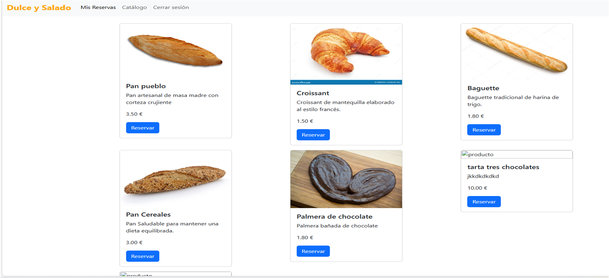
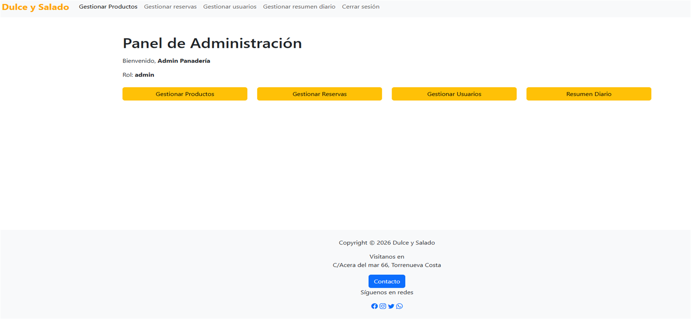

# 🍞 INSTALACIÓN Panadería Reservas (COMPLETA)

## 📋 Requisitos previos
✅ XAMPP (Apache + MySQL)
✅ PHP 8.0+
✅ MySQL 8.0+
✅ Carpeta libre: C:\xampp\htdocs\

text

## 🚀 PASOS INSTALACIÓN (5 min)

### **Paso 1: Preparar proyecto**
Descargar: panaderia-reservas-2026-02-20.zips

Descomprimir

Copiar carpeta → C:\xampp\htdocs\panaderia-reservas\

text

### **Paso 2: Configurar XAMPP**
Abrir XAMPP Control Panel

START → Apache (verde)

START → MySQL (verde)

text

### **Paso 3: Instalar Base de Datos**
Abrir: http://localhost/phpmyadmin/

Verificar: base de datos VACÍA

Abrir: http://localhost/panaderia-reservas/database/instalar_panaderia.php

text
**Resultado esperado:**
✅ Usuarios OK
✅ Productos OK
✅ Reservas OK
✅ Líneas reserva OK
✅ Admin OK
✅ Productos prueba OK
🎉 ¡PANADERÍA INSTALADA!

text

### **Paso 4: SEGURIDAD crítica**
❌ BORRAR: database/instalar_panaderia.php
❌ BORRAR: database/ (vacía)

text

### **Paso 5: Primera prueba**
Landing: http://localhost/panaderia-reservas/
Admin: admin@panaderia.com / admin123
Cliente: cliente@panaderia.com / cliente123

text

## ✅ Verificación final
[ ] XAMPP Apache+MySQL verdes
[ ] Instalador ejecutado ✓
[ ] Instalador borrado ✓
[ ] Login admin funciona
[ ] Productos visibles

text

## 🔧 Problemas comunes
❌ "Error conexión BD" → MySQL no iniciado
❌ "Tabla existe" → Borrar BD manual phpMyAdmin
❌ "Permisos" → Ejecutar XAMPP como Admin

text

## 📸 Capturas de la aplicación

### Vista del Catálogo

### Panel de Administración

---
**Jorge Toquero** - DAW Motril 2026
**Última actualización: 20/02/2026**